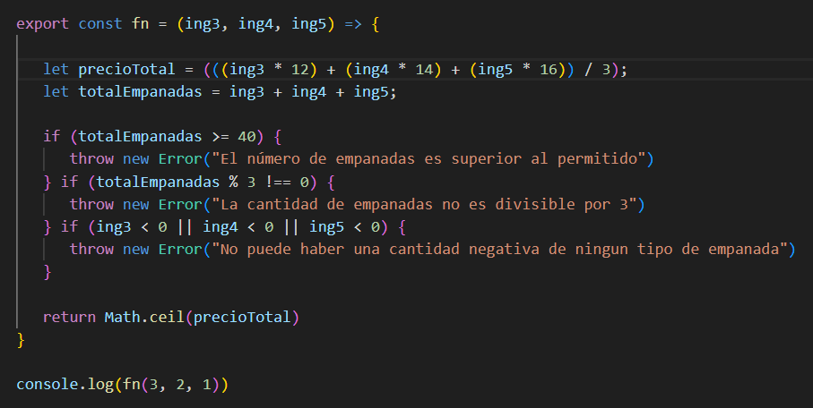

# El Reparto de Empanadas
This is a recreation of a meet between geekshubs academy students, were they have to distribute "Empanadillas" in groups of three to take advantage of a 3X1 discount to save as money as possible. This is solved through a function explained below.

### TABLE OF CONTENTS :open_file_folder: 
- [El Reparto de Empanadas](#el-reparto-de-empanadas)
    - [TABLE OF CONTENTS :open\_file\_folder:](#table-of-contents-open_file_folder)
    - [STACK :wrench:](#stack-wrench)
    - [FEATURES :bulb:](#features-bulb)
    - [WHERE TO TRY AND VISUALIZE IT :mag:](#where-to-try-and-visualize-it-mag)
    - [DATABASE DESING :computer:](#database-desing-computer)
    - [AUTHOR :pencil2:](#author-pencil2)
    - [POTENTIAL IMPROVEMENTS :heavy\_check\_mark:](#potential-improvements-heavy_check_mark)
    - [ACKNOWLEDGMENTS :raised\_hands:](#acknowledgments-raised_hands)

### STACK :wrench:

### FEATURES :bulb:

-Introduce any amount of empanadillas to be bought. The function throws the cheapest price for the asked combination

### WHERE TO TRY AND VISUALIZE IT :mag: 

Find the repository of this proyect on this link:

https://github.com/MR-ant1/Proyecto-L-gica-javascript.git

To run and visualize it online, click the next link down below:
PONER ENLACE PAGES
https://mr-ant1.github.io/Television-interactiva/

### DATABASE DESING :computer:

(Screenshot showing the implemented fusion)

### AUTHOR :pencil2:
- Antonio Rodrigo - Full Stack Developer student

- <a href="https://github.com/MR-ant1">GitHub - <a href="https://www.linkedin.com/in/antonio-rodrigo-camacho-306b60205?lipi=urn%3Ali%3Apage%3Ad_flagship3_profile_view_base_contact_details%3BbZw124AlRu2kGWtATXloag%3D%3D">Linkedin</a>

### POTENTIAL IMPROVEMENTS :heavy_check_mark: 

After many tries of reformulate the function to implement a bucle which combines al prices between them, the final method used to calculate the cheapest price has been a ponderated media that use each kind of Empanada's relative price (basing on each price) as a way to solve the combinations discounts deppending on each mix.

### ACKNOWLEDGMENTS :raised_hands:

Big shout out to GeeksHubs for giving me the chance to learn about all this amazing world of "developing"
More and better proyects are coming nearly thanks to them!

[def]: #Acknowledgments-

:arrow_up: [Table-of-contents](#table-of-contents-open_file_folder)